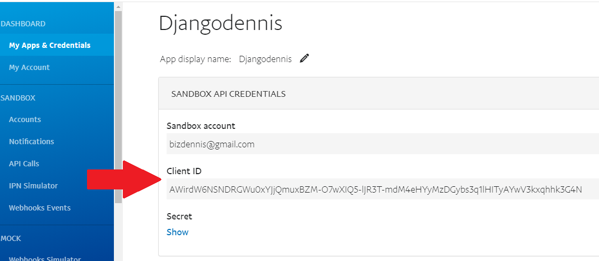

# Payment Setup: Sandbox Account

## Part 1 | Test payments
I went over this the paypal sandbox account briefly in my intro to part 1 but now its time to set up a sandbox account to test payments before we integrate with a real paypal account. 

### Step 1 | Create Sandbox Account
Go to https://developer.paypal.com/developer/accounts/ and login with your existing paypal account.

#### Create two sandbox accounts
Once you are logged in, within the left sidebar under "sandbox" go the "accounts" link. Here we will create 2 sandbox accounts. One will be a “business” account which will receive payments and another will be a personal account which will represent a customer that will purchase a product on our website.
 

#### Custom account
By default when you click on the “Create account” button you will be prompted to choose business OR personal for the account type. If you want to be able to set your own passwords and email and not have to use the default setup paypal gives you click on the “Create custom account” option. Here just fill in the required fields.
 

#### Login to sandbox accounts
Once you have created a business and personal sandbox account you can go to www.sandbox.paypal.com and login to both accounts individually to ensure they work. This will look exactly like a real paypal account only now you will see “sandox” at the beginning of the url and you can make transactions without real money.

### Step 2 | Create App
Now that we have our two sandbox accounts set up, what we need to do next is create an “app” within paypal to generate a “Client ID”. This client ID will be added to the script tag within our template so when a customer makes a purchase, paypal knows where to send the money.

#### Create App

Still inside https://developer.paypal.com/developer/accounts/, underneath “Dashboard” click on “My Apps & Credentials”  and click the “Sandbox” tab. 

Down below you will see a default app and a “Create App” button. Create an app and name it something simular to what you called your website.

#### Client ID
Once you create your new app, open it up and copy the client ID. 

For now we will use only the “Client ID” and not the “Secret Key”. Secret key is for server side integration and should never be displayed publicly.

#### Add Client ID to script tag
Once we have our client ID copied, open up checkout.html and replace “client-id=sb” with what your apps client id “client-id=YOUR-CLIENT-ID”

### Part 2 | Making Payments
#### Overview:
At this point we have most everything we need for the payment integration. Now we just need to test our payments, set the price to represent our order total and process the order on the backend when the payment is successful.

##### Step 1 | Test Payments
Lets first test the Paypal checkout button within our checkout page. Click the button and login with the “personal” sandbox account we just set up. 

Right now you total should only be $0.01 because we have not configured the price yet. Go ahead and complete the order, then login to both sandbox accounts and make the transactions go through on both ends. 

Once you complete this transaction you should be able to login you your sandbox accounts and see it within your account activity, this may take a few minutes to appear so give it some time.

### Step 2 | Setting Price
Now that our buttons are working and we have seen a transaction go through, we can set the price to represent our actual cart total and not just $0.01.

#### Move "total"

Let's first start by moving our “total” variable to the top of the script tag we added for our paypal buttons. We need to access this total without our buttons so we need this value available right away. 

[10_total](imgs/10_total.png)

#### Add total to buttons

Now we can replace $0.01 with our cart total. Because this value is a string we will need to convert it to a float and then ensure that we only have two decimal places to the right. 

No if we click the paypal checkout button we should see the real cart total. 
[View Source Code](https://github.com/divanov11/ecom_steps/blob/master/m5-p3-s2-checkout.html)

 

